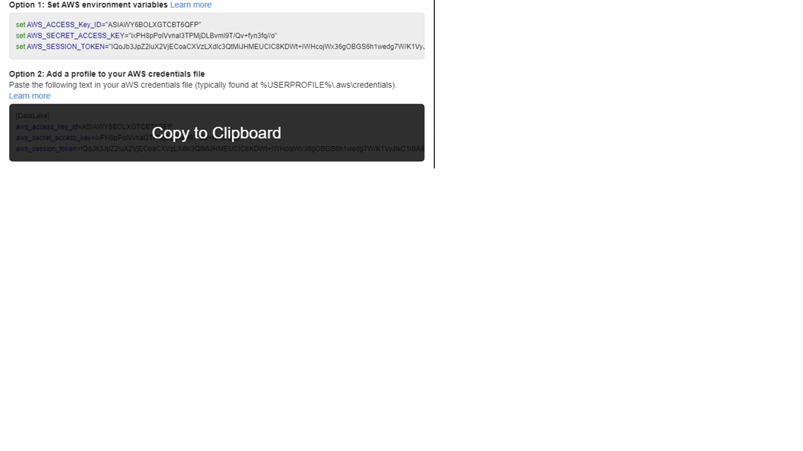

# How to use excel with sts tokens
## Introduction

The purpose of this document is to outline steps required to connect Microsoft Excel to AWS Athena as a data source and utilize Excel as a BI tool to perform data analytics. 

## Create credentials file on laptop
Create the AWS credential files on the local computer.

•	Create directory c:\Users\<username>\.aws

•	Create a file with the name ‘credentials’ in this newly created directory

•	Add lines from below instructions to the ‘credentials’ file and save,

Login into: https://dp1luaobhtxif.cloudfront.net/
Click on “Access Keys” for either SdapDevAnalyst1, 2, or 3.
Under Option2 move the cursor to the highlighted area which changes to “Copy to Clipboard” with a black background. 
 
Click on “Copy to Clipboard” and paste values into the “credentials” file.

Credentials file location
    
Contents of the credentials file
    
## Download ODBC driver
•	Download the Amazon Athena ODBC driver by clicking the link below:
https://docs.aws.amazon.com/athena/latest/ug/connect-with-odbc.html
Select the driver for your operating environment, Windows, Linux, OSX 32 or 64 bit ODBC driver.

Note*: Although Windows 10 OS is: 64 bit operating system, x86 based processor, the 64 bit driver may not be the correct version.
The ODBC driver bit must match to that of Microsoft Excel.
Find bit level of Excel on your computer
Select the File tab from the Excel ribbon and then select Help
Your version and bit-level of Excel will appear under About Microsoft Excel - Diagram below.

## Install ODBC driver
Note: Admin access is required to install and configure ODBC driver on a laptop.
Click on the downloaded ODBC driver file to install it.

