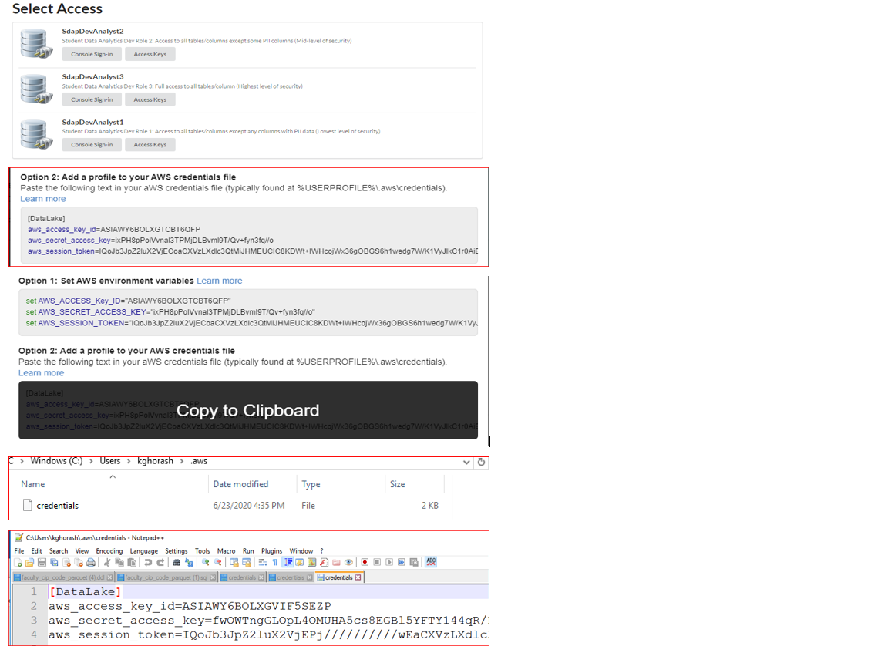
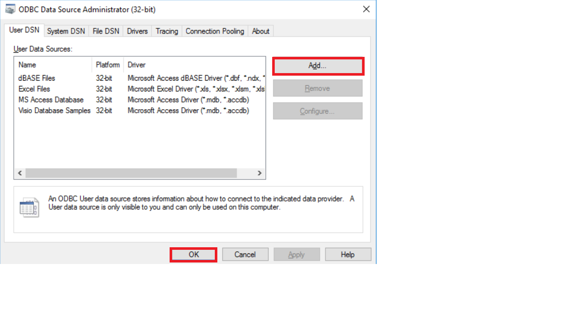
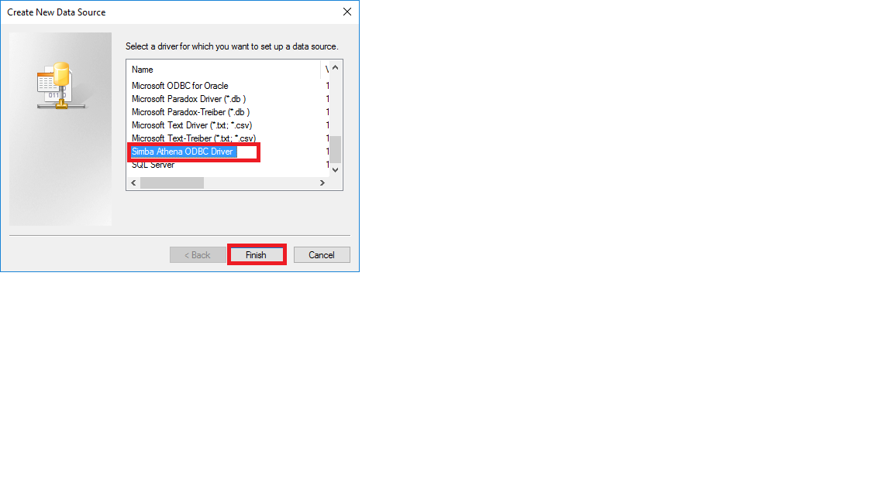
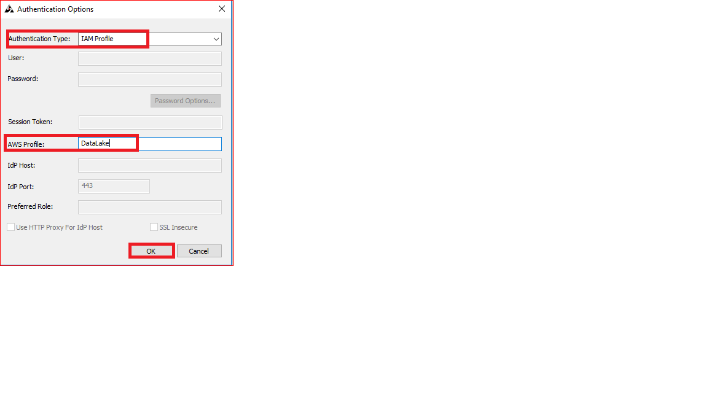
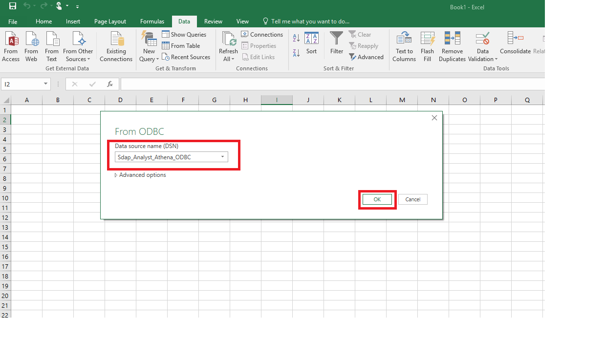
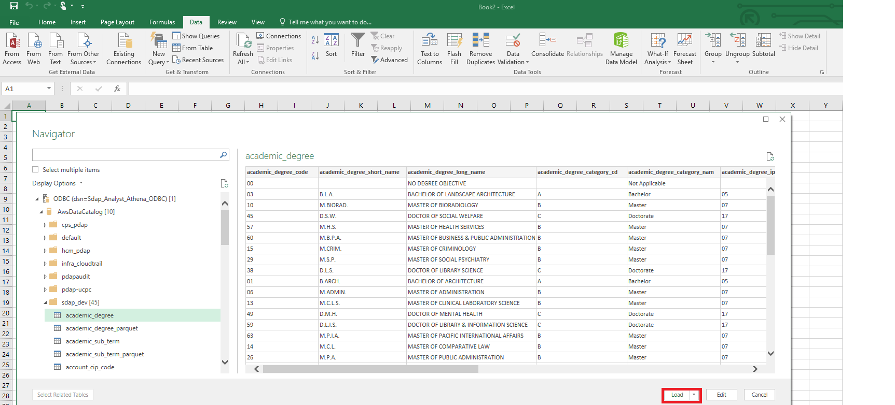

# How to use excel with sts tokens
## Introduction

The purpose of this document is to outline steps required to connect Microsoft Excel to AWS Athena as a data source and utilize Excel as a BI tool to perform data analytics. 

## Create credentials file on laptop
Create the AWS credential files on the local computer.

•	Create directory c:\Users\<username>\.aws

•	Create a file with the name ‘credentials’ in this newly created directory

•	Add lines from below instructions to the ‘credentials’ file and save,

Login into: https://dp1luaobhtxif.cloudfront.net/

Click on “Access Keys” for either SdapDevAnalyst1, 2, or 3.

Under Option2 move the cursor to the highlighted area which changes to “Copy to Clipboard” with a black background. 

Click on “Copy to Clipboard” and paste values into the “credentials” file.

   

## Download ODBC Driver
•	Download the Amazon Athena ODBC driver by clicking the link below:
https://docs.aws.amazon.com/athena/latest/ug/connect-with-odbc.html
Select the driver for your operating environment, Windows, Linux, OSX 32 or 64 bit ODBC driver.

Note*: Although Windows 10 OS is: 64 bit operating system, x86 based processor, the 64 bit driver may not be the correct version.
The ODBC driver bit must match to that of Microsoft Excel.
Find bit level of Excel on your computer
Select the File tab from the Excel ribbon and then select Help
Your version and bit-level of Excel will appear under About Microsoft Excel - Diagram below.

## Install ODBC Driver
Note: Admin access is required to install and configure ODBC driver on a laptop.

Click on the downloaded ODBC driver file to install it.

Click *Run* to start the installation.

Click *Next* to continue.

Click *Next* to continue.

Click *Finish* to complete the installation.
  

## Configure ODBC Driver
Installation of the ODBC driver will create a new system data source in *ODBC Data Source Administrator* under *system DSN* tab

From the Control panelAdministrative Tools

Open “*Setup ODBC data sources (32-bit)*” or “(64-bit)”

Create a new User data source by selecting “Add” under “*User DSN*” tab and "*OK*" to continue.

In "*Create New Data Source"* window select "*Simba Athena ODBC Driver*" and Click "*Finish*"

Complete the “*Simba Athena ODBC Driver DSN Setup*” window.

**Data Source Name**: Provide a name for the data source

**Description**: Add a description for the data source

**AWS Region**: us-west-2

**Schema**: Enter schema/database name (sdap_dev)

**S3 Output Location**: [Enter an S3 location with read/write accessibility ]
(s3://aws-athena-query-results-us-west-2-465872772557)

Click on “*Authentication Options…*” tab on the bottom

In the "*Authentication Options*" window from “*Authentication Type*” drop down: Select ‘*IAM Profile*’ 

**AWS Profile**: DataLake

***Note: This 'AWS Profile' name must match the label in the credentials file stored on the computer.***

Click *OK* to close the window.

In the “*Simba Athena ODBC Driver DSN Setup*” window, click on “Test…” tab on the bottom to test the connection.

Click *OK* to close all windows.

## Connect Excel to AWS Athena

Open a new Excel file.

Click on ‘*Data*’ tab

*DataNew QueryFrom Other SourcesFrom ODBC

Select “*Sdap_Analyst_Athena_ODBC*” from the drop down list and then click “*OK*”

(This is the name of the data sources created during ODBC configuration).

Alternatively click “*Advanced Options*” to enter a customized SQL statement.

Click “*Load*” to load data to the spreadsheet

